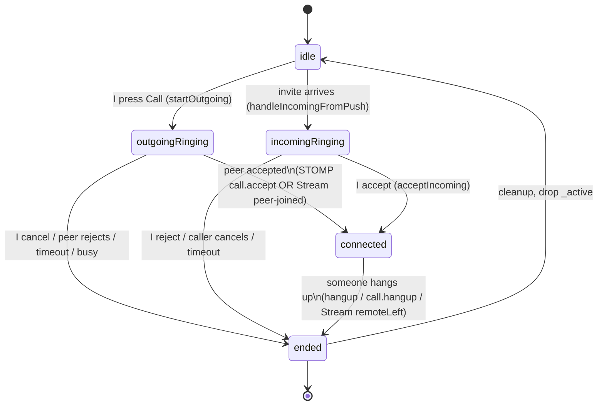
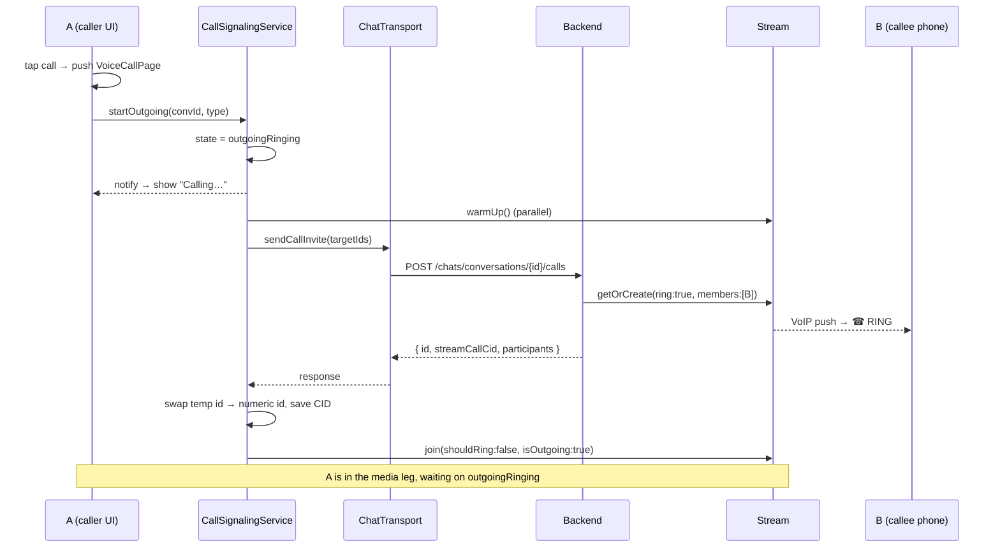
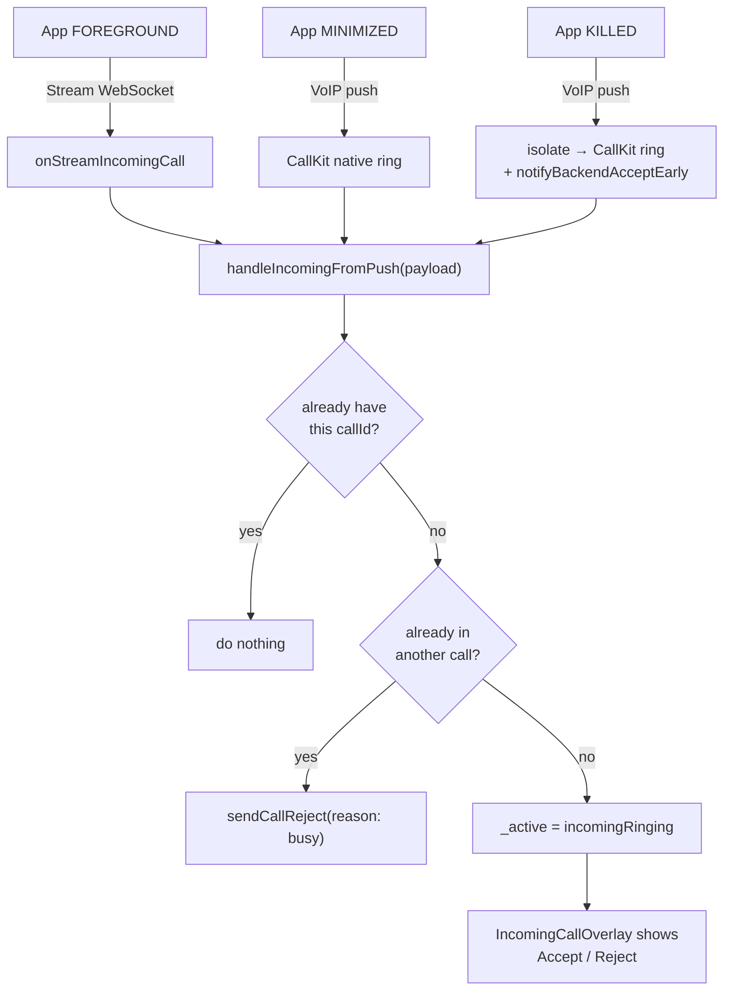
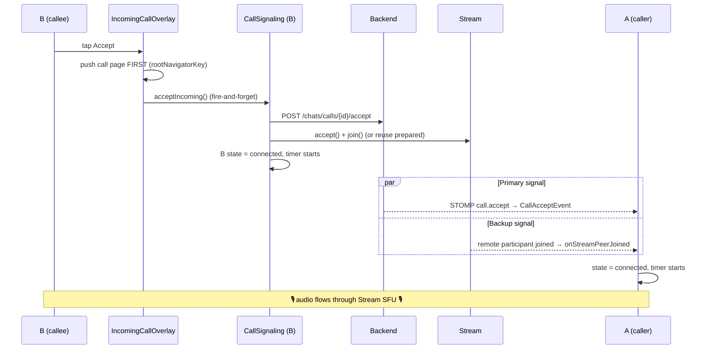
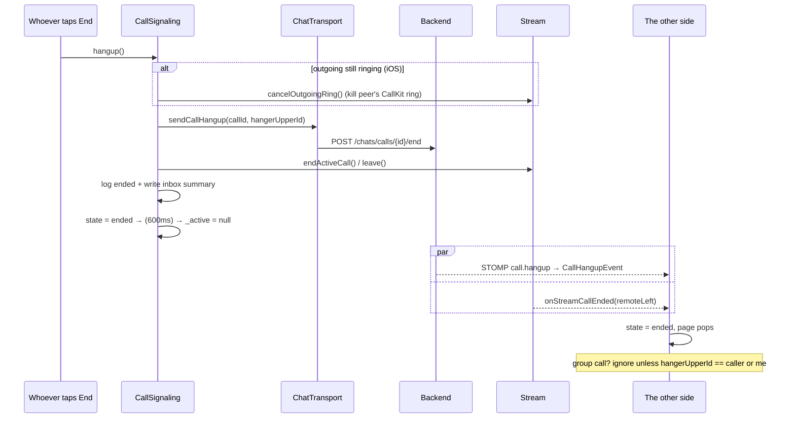
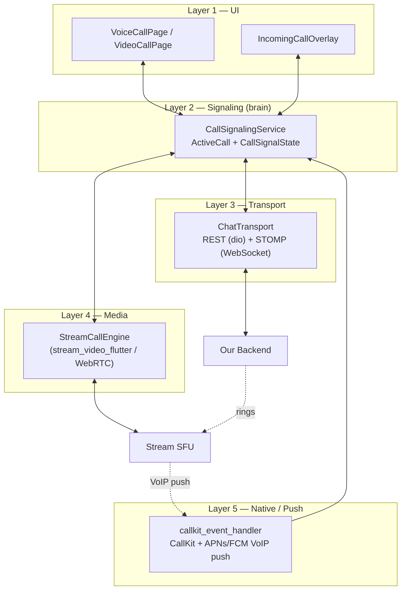

# Lesson 6 — All the Flowcharts 🧭

This lesson collects every diagram in one place. These use **Mermaid** — if you
open this file on GitHub or in a Markdown viewer that supports Mermaid, they
render as real diagrams. (In a plain editor you still read them as text.)

---

## 6.1 — The state machine (the brain's moods)



---

## 6.2 — Outgoing call (A presses Call)



---

## 6.3 — Incoming call (B's three paths funnel into one handler)



---

## 6.4 — Accept → connected (the two signals)



---

## 6.5 — End / hangup (and how the peer learns)



---

## 6.6 — The layered architecture (zoom out)



---

## 6.7 — One-page cheat sheet

```
START A CALL
  button → push VoiceCallPage → initState → startOutgoing()
  → state=outgoingRinging (UI: "Calling…")
  → POST /chats/conversations/{id}/calls
  → backend Stream getOrCreate(ring:true) → VoIP push → B rings
  → swap id, save CID → streamEngine.join(shouldRing:false)

RECEIVE A CALL
  foreground: Stream WS · background/killed: VoIP push → CallKit
  → handleIncomingFromPush → state=incomingRinging
  → IncomingCallOverlay (Accept / Reject)

ACCEPT
  push call page FIRST → acceptIncoming()
  → POST /accept + Stream accept()+join() → state=connected
  caller flips via STOMP call.accept OR Stream peer-joined fallback

TALK
  Stream SFU carries audio/video · timer ticks · iOS audio re-asserts

END
  hangup() → POST /end + Stream leave() → state=ended → cleanup
  peer learns via STOMP call.hangup OR Stream remoteLeft
  log + inbox summary written
```

Next: **[Lesson 7 — Apply to another project](07-apply-to-another-project.md)**,
then **[Lesson 8 — The 4 incoming-call cases](08-incoming-call-4-cases.md)**.

⬅ Back to the [index](README.md).
