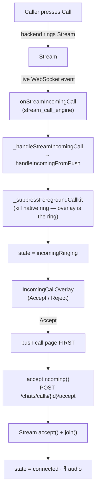
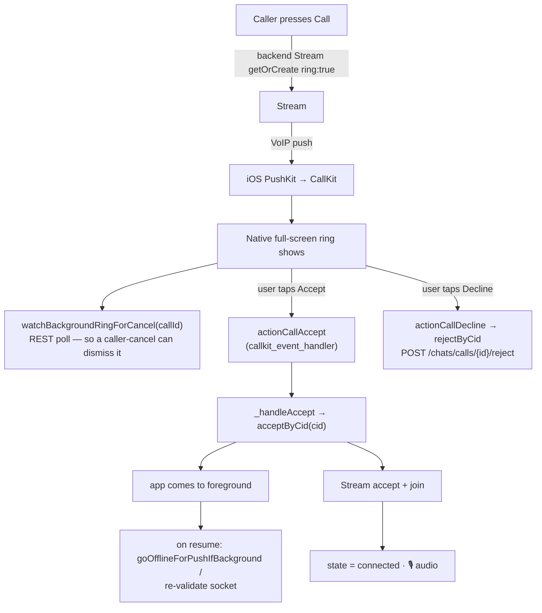
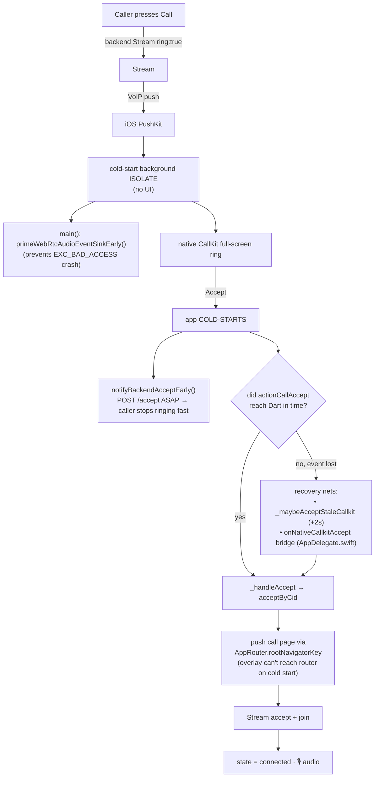
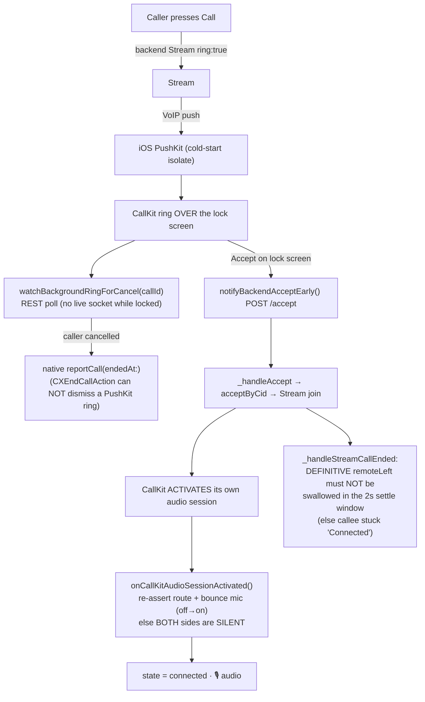

# Lesson 8 — The 4 Incoming-Call Cases (diagrams) 📲

A call **out** is always the same. But a call **in** behaves very differently
depending on what the callee's phone is doing. There are **4 cases**:

| # | Case | App process? | Stream WebSocket? | What rings the phone |
|---|------|--------------|-------------------|----------------------|
| 1 | **In app (foreground)** | running, on screen | ✅ alive | in-app overlay (CallKit suppressed) |
| 2 | **Minimized (background)** | running, hidden | ❌ dropped | native CallKit (VoIP push) |
| 3 | **Killed app** | ❌ not running | ❌ none | native CallKit (VoIP push cold-starts an isolate) |
| 4 | **Killed + locked screen** | ❌ not running | ❌ none | native CallKit over the lock screen |

The harder the case (1 → 4), the more "safety nets" the code needs. Below is one
diagram per case, drawn from the real code.

---

## 🟢 CASE 1 — Call in app (foreground)

**Easiest.** The app is open, so Stream's WebSocket is already connected and
just hands us the call. On iOS the native CallKit screen is **suppressed** — the
in-app overlay IS the ring.



**📺 Screen + URL drawing (ASCII — renders anywhere):**
```
  PHONE STATE: app OPEN on screen
  ┌─────────────────────────────────────────────────────────────┐
  │ 1. Stream WebSocket delivers the call (no push needed)        │
  │      onStreamIncomingCall → handleIncomingFromPush            │
  └───────────────────────────┬─────────────────────────────────┘
                              ▼
  ┌─────────────────────────────────────────────────────────────┐
  │ SCREEN ► IncomingCallOverlay   (native CallKit suppressed)    │
  │          ┌───────────────────────────┐                       │
  │          │   (caller photo + name)   │                       │
  │          │   ⛔ Reject    ✅ Accept   │                       │
  │          └───────────────────────────┘                       │
  │  URL (build media):  GET  /api/v1/chats/calls/stream-token   │
  └─────────────┬───────────────────────────────┬───────────────┘
        Accept ▼                        Reject ▼
  ┌──────────────────────────────┐   ┌──────────────────────────┐
  │ SCREEN ► VoiceCallPage /      │   │ URL: POST .../{id}/reject│
  │          VideoCallPage        │   └──────────────────────────┘
  │ URL: POST .../{id}/accept     │
  │ 🎙 connected · timer ticking  │
  │ URL on End: POST .../{id}/end │
  └──────────────────────────────┘
```

**Key files/lines:** `call_signaling_service.dart:811` (`_handleStreamIncomingCall`),
`:915` (`handleIncomingFromPush`), `:1327` (`_suppressForegroundCallkit`),
`incoming_call_overlay.dart`, `:1688` (`acceptIncoming`).

---

## 🟡 CASE 2 — Call while app is minimized (background)

The app is alive but hidden. iOS suspended the Stream WebSocket to save battery,
so the foreground path can't fire. Instead a **VoIP push → native CallKit**
full-screen ringer appears. Tapping Accept brings the app forward.



**📺 Screen + URL drawing (ASCII):**
```
  PHONE STATE: app MINIMIZED (hidden) · Stream WebSocket DROPPED
  ┌─────────────────────────────────────────────────────────────┐
  │ 1. Stream sends a VoIP PUSH (because the socket is gone)      │
  │      iOS PushKit → CallKit                                    │
  └───────────────────────────┬─────────────────────────────────┘
                              ▼
  ┌─────────────────────────────────────────────────────────────┐
  │ SCREEN ► NATIVE CallKit ring  (NOT a Flutter screen)         │
  │          the green system "incoming call" UI                 │
  │  background poll: GET /api/v1/chats/calls/{id}               │
  │     (watchBackgroundRingForCancel — dismiss if caller cancels)│
  └─────────────┬───────────────────────────────┬───────────────┘
        Accept ▼                        Decline ▼
  ┌──────────────────────────────┐   ┌──────────────────────────┐
  │ app FOREGROUNDS, then:        │   │ URL: POST .../{id}/reject │
  │ SCREEN ► VoiceCallPage /      │   └──────────────────────────┘
  │          VideoCallPage        │
  │ URL: GET  .../calls/stream-token
  │ URL: POST .../{id}/accept     │
  │ 🎙 connected                  │
  │ URL on End: POST .../{id}/end │
  └──────────────────────────────┘
```

**Why the extra `watchBackgroundRingForCancel`?** A minimized/locked callee has
no live STOMP or Stream socket, so it can't hear the caller hang up. We **poll**
the backend (`GET /chats/calls/{id}`); if the caller cancelled, we dismiss the
native ring ourselves. (Project memory: *"caller-cancel dismisses minimized
callee ring"*.)

**Key files/lines:** `callkit_event_handler.dart` (`_handleAccept`,
`actionCallAccept`), `call_signaling_service.dart:1423`
(`watchBackgroundRingForCancel`), `:1467` (`goOfflineForPushIfBackground`).

---

## 🟠 CASE 3 — Call while app is KILLED (closed, unlocked)

**Hard.** There is no app process at all — no widgets, no socket, nothing. The
VoIP push must **cold-start a tiny background isolate** that shows the CallKit
ring. The accept tap then cold-starts the full app, and the accept event can
arrive **before Dart is ready** — so there are recovery nets.



**📺 Screen + URL drawing (ASCII):**
```
  PHONE STATE: app KILLED (no process) · unlocked
  ┌─────────────────────────────────────────────────────────────┐
  │ 1. Stream VoIP PUSH → iOS PushKit cold-starts an ISOLATE     │
  │    main(): primeWebRtcAudioEventSinkEarly() (anti-crash)      │
  └───────────────────────────┬─────────────────────────────────┘
                              ▼
  ┌─────────────────────────────────────────────────────────────┐
  │ SCREEN ► NATIVE CallKit ring  (full-screen system UI)        │
  └─────────────┬───────────────────────────────────────────────┘
        Accept ▼  (app COLD-STARTS)
  ┌─────────────────────────────────────────────────────────────┐
  │ URL FIRED EARLY: POST /api/v1/chats/calls/{id}/accept        │
  │   (notifyBackendAcceptEarly → caller stops ringing fast)     │
  │ recover lost event: _maybeAcceptStaleCallkit / native bridge │
  │ URL: GET /api/v1/chats/calls/{id}  (is it video? reconcile)  │
  │ URL: GET /api/v1/chats/calls/stream-token                    │
  └───────────────────────────┬─────────────────────────────────┘
                              ▼
  ┌─────────────────────────────────────────────────────────────┐
  │ SCREEN ► VoiceCallPage / VideoCallPage                       │
  │   pushed via AppRouter.rootNavigatorKey (cold-start safe)     │
  │ 🎙 connected · URL on End: POST .../{id}/end                 │
  └─────────────────────────────────────────────────────────────┘
```

**The 3 cold-start nets (why they exist):**
1. `notifyBackendAcceptEarly` — POST `/accept` immediately, decoupled from the
   slow full flow, so the **caller stops ringing** even if our startup lags.
2. `_maybeAcceptStaleCallkit` (+2s) / `onNativeCallkitAccept` — if the
   `actionCallAccept` event fired before our Dart listener existed, recover the
   accept from the native side instead of losing it.
3. `rootNavigatorKey` — during a cold start the overlay can't reach go_router
   the normal way, so we push the call page through a global navigator key.

**Key files/lines:** `main.dart:64` (`primeWebRtcAudioEventSinkEarly`),
`call_signaling_service.dart:285` (`notifyBackendAcceptEarly`),
`callkit_event_handler.dart:145` (`_maybeAcceptStaleCallkit`), `:89`
(`onNativeCallkitAccept`), `ios/Runner/AppDelegate.swift` (PushKit + bridge).

---

## 🔴 CASE 4 — Call while app is KILLED **and screen is LOCKED**

**Hardest.** Everything in Case 3, PLUS the screen is locked, which changes two
things: **CallKit owns the audio**, and the callee has **no way to hear a
caller-cancel** except polling.



**📺 Screen + URL drawing (ASCII):**
```
  PHONE STATE: app KILLED + screen LOCKED
  ┌─────────────────────────────────────────────────────────────┐
  │ 1. Stream VoIP PUSH → PushKit cold-starts isolate            │
  └───────────────────────────┬─────────────────────────────────┘
                              ▼
  ┌─────────────────────────────────────────────────────────────┐
  │ SCREEN ► NATIVE CallKit ring OVER THE LOCK SCREEN            │
  │  cancel poll: GET /api/v1/chats/calls/{id}                   │
  │     caller cancelled? → native reportCall(endedAt:) dismisses│
  │     (a normal endCall can NOT remove a PushKit ring)         │
  └─────────────┬───────────────────────────────────────────────┘
        Accept ▼  (on the lock screen)
  ┌─────────────────────────────────────────────────────────────┐
  │ URL EARLY: POST /api/v1/chats/calls/{id}/accept             │
  │ Stream accept + join                                         │
  │ ⚠ CallKit OWNS audio → onCallKitAudioSessionActivated()     │
  │    re-assert route + bounce mic (else BOTH sides SILENT)     │
  │ ⚠ end-guard: definitive remoteLeft must NOT be swallowed     │
  └───────────────────────────┬─────────────────────────────────┘
                              ▼
  ┌─────────────────────────────────────────────────────────────┐
  │ SCREEN ► VoiceCallPage / VideoCallPage                       │
  │   pushed via AppRouter.rootNavigatorKey                       │
  │ 🎙 connected · URL on End: POST .../{id}/end                 │
  └─────────────────────────────────────────────────────────────┘
```

**Two locked-screen-specific dangers the code handles:**

1. **Silent audio** — because the user accepted from CallKit (not our UI),
   **CallKit owns the `AVAudioSession`** and activates it a beat *after* our
   `join()`. That resets WebRTC's audio unit → no sound. Fix:
   `onCallKitAudioSessionActivated()` re-asserts the route and bounces the mic
   off→on on the now-live session.

2. **Stuck "Connected"** — B accepts from the lock screen, A hangs up
   immediately. Stream fires a *definitive* `remoteLeft` within the first 2
   seconds. An old version settle-guarded ALL end reasons and swallowed it → B
   was stuck on Connected forever. Fix: only the flaky `disconnected` reason is
   settle-guarded; `remoteLeft` always ends the call (project memory: *"B stuck
   Connected"*).

3. **Dismissing the ring on caller-cancel** — a locked phone can't get the
   hangup over a socket. `watchBackgroundRingForCancel` polls REST, and dismissal
   must use the **native** `reportCall(endedAt:)` (a normal `CXEndCallAction`
   does **not** remove a PushKit incoming-call screen).

**Key files/lines:** `stream_call_engine.dart:401`
(`onCallKitAudioSessionActivated`), `call_signaling_service.dart:723`
(`_handleStreamCallEnded` settle rule), `:1216` (native `reportCall(endedAt:)`
channel), `:1423` (`watchBackgroundRingForCancel`),
`ios/Runner/AppDelegate.swift`.

---

## 📊 All 4 cases, side by side

```
            ┌──────────────┬───────────────┬─────────────────┬─────────────────────┐
            │ 1 FOREGROUND │ 2 MINIMIZED   │ 3 KILLED        │ 4 KILLED + LOCKED   │
 ───────────┼──────────────┼───────────────┼─────────────────┼─────────────────────┤
 rings via  │ in-app       │ CallKit       │ CallKit         │ CallKit (lock screen)│
            │ overlay      │ (VoIP push)   │ (push + isolate)│ (push + isolate)    │
 Stream WS  │ alive ✅     │ dropped ❌    │ none ❌         │ none ❌             │
 cold start │ no           │ no            │ YES             │ YES                 │
 owns audio │ app          │ app           │ app             │ CallKit ⚠           │
 extra nets │ suppress     │ ring-cancel   │ + early accept  │ + audio re-assert   │
            │ native ring  │ poll          │ + stale recover │ + end-guard rule    │
            │              │               │ + rootNavKey    │ + reportCall dismiss│
 ───────────┴──────────────┴───────────────┴─────────────────┴─────────────────────┘
 difficulty:   ●○○○            ●●○○             ●●●○                ●●●●
```

> 🧠 **The pattern to remember:** every case ends at the SAME place —
> `handleIncomingFromPush → incomingRinging → Accept → acceptIncoming →
> connected`. The 4 cases differ only in **how the ring reaches the phone** and
> **how many safety nets** are needed to survive a cold start + locked screen.

---

## 📇 Screens + URLs per case (the lookup table)

> ⚠️ Note for this project: the call **screens are pushed widgets, NOT named
> routes** — there is no go_router URL like `/chat/voice-call`. So "screen" =
> the Flutter **class + file**. "URL" = the **backend REST endpoint** that fires.

### The screens (same 3 classes in every case)
| Screen (class) | File | Role |
|---|---|---|
| `IncomingCallOverlay` | `lib/features/chat/widgets/incoming_call_overlay.dart` | The in-app Accept/Reject ring popup. |
| `VoiceCallPage` | `lib/features/chat/views/voice_call_page.dart` | Voice in-call screen (Calling…/timer/End). |
| `VideoCallPage` | `lib/features/chat/views/video_call_page.dart` | Video in-call screen. |
| *(native CallKit ring)* | iOS system / `flutter_callkit_incoming` | NOT a Flutter screen — the green system ring. No URL/route. |

### 🟢 CASE 1 — In app (foreground)
- **Ring screen:** `IncomingCallOverlay` (native CallKit suppressed)
- **In-call screen:** `VoiceCallPage` / `VideoCallPage` (pushed on Accept)
- **URLs that fire:**
  - `GET  /api/v1/chats/calls/stream-token` (build Stream client)
  - `POST /api/v1/chats/calls/{id}/accept` (on Accept) · or `/reject` (on Decline)
  - `POST /api/v1/chats/calls/{id}/end` (on hang up)

### 🟡 CASE 2 — Minimized (background)
- **Ring screen:** native CallKit ring (NOT a Flutter screen) → on Accept the app
  foregrounds and pushes `VoiceCallPage` / `VideoCallPage`
- **URLs that fire:**
  - `GET  /api/v1/chats/calls/stream-token`
  - `GET  /api/v1/chats/calls/{id}` ← **extra** (`watchBackgroundRingForCancel` poll)
  - `POST /api/v1/chats/calls/{id}/accept` · or `/reject`
  - `POST /api/v1/chats/calls/{id}/end`

### 🟠 CASE 3 — Killed app
- **Ring screen:** native CallKit ring (cold-start isolate) → on Accept cold-start
  → push `VoiceCallPage` / `VideoCallPage` via `AppRouter.rootNavigatorKey`
- **URLs that fire:**
  - `POST /api/v1/chats/calls/{id}/accept` ← **fired EARLY** (`notifyBackendAcceptEarly`)
  - `GET  /api/v1/chats/calls/stream-token`
  - `GET  /api/v1/chats/calls/{id}` (`isVideoCall` / `prepareIncoming` reconcile)
  - `POST /api/v1/chats/calls/{id}/end`

### 🔴 CASE 4 — Killed + locked screen
- **Ring screen:** native CallKit ring **over the lock screen** → on Accept push
  `VoiceCallPage` / `VideoCallPage` via `AppRouter.rootNavigatorKey`
- **URLs that fire:** same as Case 3, plus:
  - `GET  /api/v1/chats/calls/{id}` (`watchBackgroundRingForCancel` — dismiss ring
    if caller cancelled, via native `reportCall(endedAt:)`)
- **Caller-side video/voice screen** is `VoiceCallPage`/`VideoCallPage` as usual.

> 🧠 Notice: the **screen classes are the same in all 4 cases** — only the *ring*
> differs (in-app overlay vs native CallKit) and the *URLs add safety-net calls*
> (`GET /{id}` polls, early `/accept`). Find your case by: *is the app open?* →
> overlay. *Closed?* → native CallKit + cold start.

---

## ✅ Check yourself

1. In which case is the native CallKit ring **suppressed**, and why?
   *(Case 1 foreground — the in-app overlay is the ring instead.)*
2. Why does a killed app need `notifyBackendAcceptEarly`? *(Cold start is slow;
   POST /accept early so the caller stops ringing without waiting for full
   startup.)*
3. In the locked case, who owns the audio session and what breaks if you ignore
   it? *(CallKit owns it; it activates late and resets WebRTC → both sides
   silent unless you re-assert the route + bounce the mic.)*
4. Why can't a normal `endCall` dismiss the lock-screen ring? *(It's a PushKit
   incoming call; only native `reportCall(endedAt:)` dismisses it.)*

Back to the [index](README.md).
